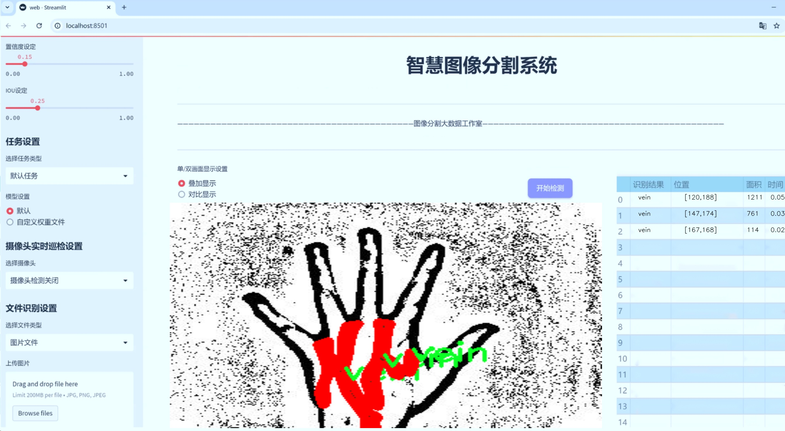
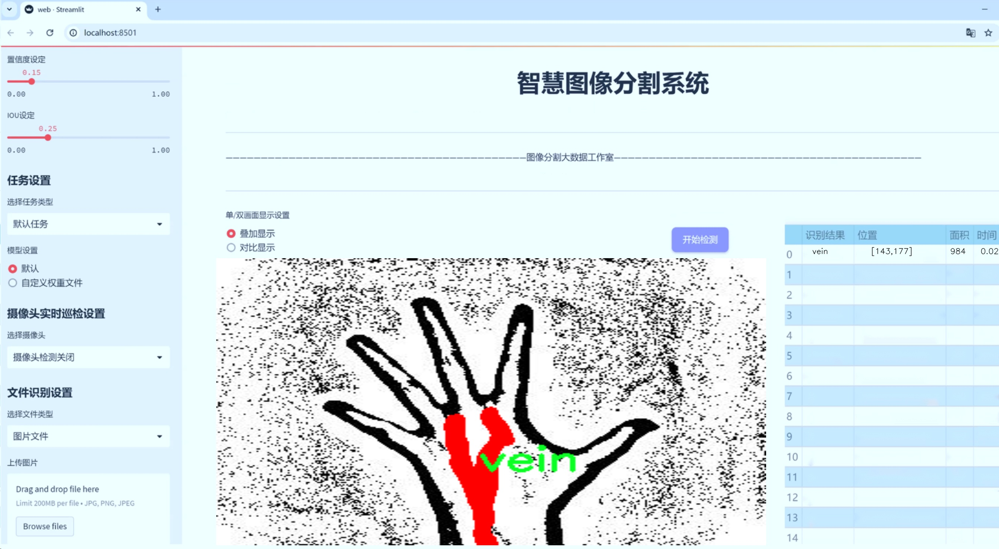
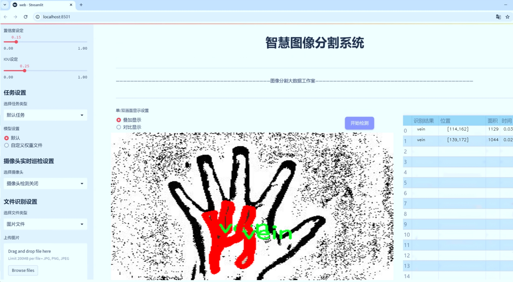
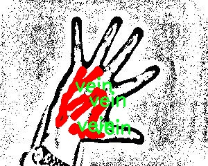
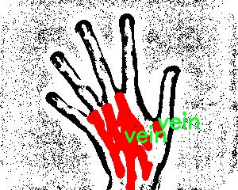
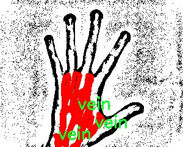
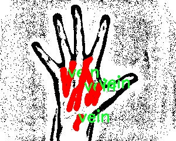
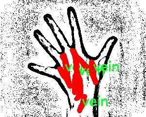

# 手部静脉图像分割系统： yolov8-seg-efficientViT

### 1.研究背景与意义

[参考博客](https://gitee.com/YOLOv8_YOLOv11_Segmentation_Studio/projects)

[博客来源](https://kdocs.cn/l/cszuIiCKVNis)

研究背景与意义

随着生物识别技术的快速发展，手部静脉识别作为一种新兴的身份验证方式，逐渐引起了学术界和工业界的广泛关注。手部静脉图像具有独特的生物特征，其内部静脉分布模式相对稳定且难以伪造，因而在安全性和可靠性方面表现出色。相比于传统的指纹、面部识别等生物识别技术，手部静脉识别在光照变化、表面污垢和生理变化等干扰因素下，依然能够保持较高的识别精度。因此，研究和开发基于手部静脉图像的识别系统，具有重要的理论价值和实际应用意义。

在手部静脉图像的处理过程中，图像分割技术是实现高效识别的关键环节。准确的静脉图像分割能够有效提取出手部静脉的特征信息，为后续的特征提取和分类提供基础。然而，传统的图像分割方法往往面临着分割精度低、处理速度慢等问题，难以满足实时性和高准确率的要求。近年来，深度学习技术的迅猛发展为图像分割提供了新的解决方案，尤其是基于卷积神经网络（CNN）的实例分割模型，已经在多个领域取得了显著的成果。

YOLO（You Only Look Once）系列模型因其快速的检测速度和较高的准确率，成为了目标检测和实例分割领域的热门选择。YOLOv8作为该系列的最新版本，进一步优化了模型结构和算法性能，能够在保证检测精度的同时，实现更快的推理速度。然而，针对手部静脉图像的特定特征，YOLOv8仍需进行相应的改进，以适应静脉图像的复杂性和多样性。

本研究旨在基于改进的YOLOv8模型，构建一个高效的手部静脉图像分割系统。通过对手部静脉数据集的深入分析，利用1000张手部静脉图像进行训练和测试，确保模型能够充分学习到静脉的特征信息。数据集中仅包含一个类别（静脉），这为模型的训练提供了清晰的目标，减少了分类复杂性。同时，借助roboflow-3-n-seg模型，能够实现对手部静脉的精准分割，提升后续识别过程的准确性。

该研究不仅为手部静脉识别技术的发展提供了新的思路和方法，也为相关领域的研究者提供了宝贵的数据集和模型参考。通过改进YOLOv8的手部静脉图像分割系统，能够推动生物识别技术在安全、金融、医疗等领域的应用，提升身份验证的安全性和便捷性。此外，本研究的成果也将为未来在其他生物特征识别领域的应用提供借鉴，促进相关技术的进步与创新。

### 2.图片演示







注意：本项目提供完整的训练源码数据集和训练教程,由于此博客编辑较早,暂不提供权重文件（best.pt）,需要按照6.训练教程进行训练后实现上图效果。

### 3.视频演示

[3.1 视频演示](https://www.bilibili.com/video/BV1LgzcYYEB6/)

### 4.数据集信息

##### 4.1 数据集类别数＆类别名

nc: 1
names: ['vein']


##### 4.2 数据集信息简介

数据集信息展示

在本研究中，我们采用了名为“hand_vein”的数据集，以支持对手部静脉图像分割系统的训练，特别是针对改进的YOLOv8-seg模型。该数据集专注于手部静脉的识别与分割，旨在提升静脉图像处理的准确性和效率。数据集的设计考虑到了手部静脉的独特特征和复杂性，为模型的训练提供了丰富的样本和多样化的场景。

“hand_vein”数据集包含一个类别，具体为“vein”，这意味着所有的标注和数据均围绕手部静脉的特征展开。通过对手部静脉图像的精确标注，数据集为YOLOv8-seg模型提供了一个清晰的目标，帮助模型在训练过程中学习到静脉的形状、纹理和位置等重要信息。静脉图像的分割任务在医学影像分析、身份验证以及生物特征识别等领域具有重要应用，因此，该数据集的构建具有显著的实际意义。

在数据集的构成上，“hand_vein”包含了多种不同的手部静脉图像，这些图像来源于不同的个体和环境条件，确保了数据的多样性和代表性。数据集中包含的图像经过精心挑选和处理，确保其质量和清晰度，便于后续的模型训练和评估。此外，数据集还包含了多种不同的拍摄角度和光照条件下的静脉图像，这对于提高模型的鲁棒性至关重要。

在训练过程中，YOLOv8-seg模型将利用“hand_vein”数据集中的图像进行特征提取和学习。模型将通过不断迭代，优化其参数，以提高对手部静脉的分割精度。由于数据集仅包含一个类别，模型的训练过程将更加集中和高效，使其能够在特定任务上达到更高的性能。随着训练的深入，模型将逐渐掌握手部静脉的形态特征，从而在实际应用中实现更为精准的分割效果。

值得注意的是，数据集的标注过程是确保模型训练成功的关键环节。通过对手部静脉的精确标注，研究团队能够为模型提供清晰的学习目标，进而提高模型在测试集上的表现。标注的准确性直接影响到模型的泛化能力，因此，在数据集的构建过程中，研究团队采取了严格的标注标准和质量控制措施，以确保每一张图像的标注都符合预期。

综上所述，“hand_vein”数据集为改进YOLOv8-seg的手部静脉图像分割系统提供了坚实的基础。通过高质量的图像和精确的标注，该数据集不仅支持了模型的有效训练，还为后续的研究和应用奠定了良好的基础。随着研究的深入，期待该数据集能够推动手部静脉图像处理技术的发展，并在相关领域中发挥更大的作用。











### 5.项目依赖环境部署教程（零基础手把手教学）

[5.1 环境部署教程链接（零基础手把手教学）](https://www.bilibili.com/video/BV1jG4Ve4E9t/?vd_source=bc9aec86d164b67a7004b996143742dc)


[5.2 安装Python虚拟环境创建和依赖库安装视频教程链接（零基础手把手教学）](https://www.bilibili.com/video/BV1nA4VeYEze/?vd_source=bc9aec86d164b67a7004b996143742dc)

### 6.手把手YOLOV8-seg训练视频教程（零基础手把手教学）

[6.1 手把手YOLOV8-seg训练视频教程（零基础小白有手就能学会）](https://www.bilibili.com/video/BV1cA4VeYETe/?vd_source=bc9aec86d164b67a7004b996143742dc)


按照上面的训练视频教程链接加载项目提供的数据集，运行train.py即可开始训练



     Epoch   gpu_mem       box       obj       cls    labels  img_size
     1/200     0G   0.01576   0.01955  0.007536        22      1280: 100%|██████████| 849/849 [14:42<00:00,  1.04s/it]
               Class     Images     Labels          P          R     mAP@.5 mAP@.5:.95: 100%|██████████| 213/213 [01:14<00:00,  2.87it/s]
                 all       3395      17314      0.994      0.957      0.0957      0.0843

     Epoch   gpu_mem       box       obj       cls    labels  img_size
     2/200     0G   0.01578   0.01923  0.007006        22      1280: 100%|██████████| 849/849 [14:44<00:00,  1.04s/it]
               Class     Images     Labels          P          R     mAP@.5 mAP@.5:.95: 100%|██████████| 213/213 [01:12<00:00,  2.95it/s]
                 all       3395      17314      0.996      0.956      0.0957      0.0845

     Epoch   gpu_mem       box       obj       cls    labels  img_size
     3/200     0G   0.01561    0.0191  0.006895        27      1280: 100%|██████████| 849/849 [10:56<00:00,  1.29it/s]
               Class     Images     Labels          P          R     mAP@.5 mAP@.5:.95: 100%|███████   | 187/213 [00:52<00:00,  4.04it/s]
                 all       3395      17314      0.996      0.957      0.0957      0.0845


### 7.50+种全套YOLOV8-seg创新点加载调参实验视频教程（一键加载写好的改进模型的配置文件）

[7.1 50+种全套YOLOV8-seg创新点加载调参实验视频教程（一键加载写好的改进模型的配置文件）](https://www.bilibili.com/video/BV1Hw4VePEXv/?vd_source=bc9aec86d164b67a7004b996143742dc)

### YOLOV8-seg算法简介

原始YOLOv8-seg算法原理

YOLOv8-seg算法是YOLO系列中最新的目标检测与分割模型，旨在结合高效的目标检测能力与精细的图像分割技术。相较于前代模型，YOLOv8-seg在精度和速度上均有显著提升，尤其在处理复杂场景和多目标检测时展现出更为卓越的性能。该算法的核心在于其独特的网络结构设计和创新的损失计算方法，使其在实时性和准确性之间达成了良好的平衡。

YOLOv8-seg的网络结构可分为四个主要部分：输入端、骨干网络、颈部网络和头部网络。输入端首先对图像进行处理，包括马赛克数据增强、自适应锚框计算和自适应灰度填充。这些预处理步骤不仅增强了数据的多样性，还为后续的特征提取打下了良好的基础。特别是马赛克数据增强，通过将多张图像拼接在一起，增加了模型对不同场景的适应能力，从而提升了模型的泛化性能。

在骨干网络部分，YOLOv8-seg采用了C2f模块和SPPF结构。C2f模块的设计灵感来源于YOLOv7的ELAN结构，通过引入更多的分支和跨层连接，增强了模型的梯度流。这种设计使得模型能够更有效地学习到丰富的特征表示，尤其是在处理复杂的视觉信息时，能够提取出更具辨识度的特征。SPPF结构则通过空间金字塔池化的方式，进一步提升了对多尺度特征的提取能力，使得模型在面对不同大小的目标时，能够保持良好的检测效果。

颈部网络的设计采用了路径聚合网络（PAN）结构，旨在加强不同尺度特征的融合能力。PAN结构通过将来自不同层次的特征进行聚合，使得模型能够更全面地理解图像中的信息，尤其是在处理具有多样化尺度的目标时，能够有效地提升检测的准确性。这一部分的设计对于YOLOv8-seg的性能至关重要，因为在实际应用中，目标的尺度变化往往会对检测结果产生显著影响。

头部网络则是YOLOv8-seg的关键所在，它将分类和检测过程进行了解耦，主要包括损失计算和目标检测框的筛选。在损失计算方面，YOLOv8-seg采用了Task-Aligned Assigner分配策略，根据分类与回归的分数加权结果选择正样本。这种策略能够有效地提升模型在训练过程中的学习效率，使得模型能够更快地收敛到最优解。损失计算涵盖了分类和回归两个分支，其中分类分支使用二元交叉熵损失（BCELoss），而回归分支则结合了分布焦点损失（DFLoss）和完全交并比损失函数（CIOULoss），以提升模型对边界框预测的精准性。

YOLOv8-seg在目标检测方面的创新之处在于其采用了无锚框（Anchor-Free）检测方式。这一方式直接预测目标的中心点和宽高比例，显著减少了锚框的数量，从而加速了非最大抑制（NMS）过程。这种设计不仅提高了检测速度，也在一定程度上提升了检测的准确度，尤其是在目标密集的场景中，能够有效减少误检和漏检的情况。

总的来说，YOLOv8-seg算法通过其独特的网络结构和创新的损失计算方法，成功地将目标检测与图像分割技术结合在一起，展现出卓越的性能。在实际应用中，YOLOv8-seg能够在保持高检测精度的同时，实现实时处理，适用于各种复杂场景，如自动驾驶、安防监控和智能视频分析等领域。随着技术的不断进步，YOLOv8-seg无疑将在目标检测与分割领域引领新的潮流，为更多的应用场景提供强有力的支持。


### 9.系统功能展示（检测对象为举例，实际内容以本项目数据集为准）

图9.1.系统支持检测结果表格显示

  图9.2.系统支持置信度和IOU阈值手动调节

  图9.3.系统支持自定义加载权重文件best.pt(需要你通过步骤5中训练获得)

  图9.4.系统支持摄像头实时识别

  图9.5.系统支持图片识别

  图9.6.系统支持视频识别

  图9.7.系统支持识别结果文件自动保存

  图9.8.系统支持Excel导出检测结果数据


### 10.50+种全套YOLOV8-seg创新点原理讲解（非科班也可以轻松写刊发刊，V11版本正在科研待更新）

#### 10.1 由于篇幅限制，每个创新点的具体原理讲解就不一一展开，具体见下列网址中的创新点对应子项目的技术原理博客网址【Blog】：


[10.1 50+种全套YOLOV8-seg创新点原理讲解链接](https://gitee.com/qunmasj/good)

#### 10.2 部分改进模块原理讲解(完整的改进原理见上图和技术博客链接)【如果此小节的图加载失败可以通过CSDN或者Github搜索该博客的标题访问原始博客，原始博客图片显示正常】
### YOLOv8简介
#### Neck模块设计
骨干网络和 Neck 的具体变化为：

第一个卷积层的 kernel 从 6x6 变成了 3x3
所有的 C3 模块换成 C2f，结构如下所示，可以发现多了更多的跳层连接和额外的 Split 操作


去掉了 Neck 模块中的 2 个卷积连接层
Backbone 中 C2f 的 block 数从 3-6-9-3 改成了 3-6-6-3
查看 N/S/M/L/X 等不同大小模型，可以发现 N/S 和 L/X 两组模型只是改了缩放系数，但是 S/M/L 等骨干网络的通道数设置不一样，没有遵循同一套缩放系数。如此设计的原因应该是同一套缩放系数下的通道设置不是最优设计，YOLOv7 网络设计时也没有遵循一套缩放系数作用于所有模型。

#### Head模块设计
Head 部分变化最大，从原先的耦合头变成了解耦头，并且从 YOLOv5 的 Anchor-Based 变成了 Anchor-Free。其结构如下所示：


可以看出，不再有之前的 objectness 分支，只有解耦的分类和回归分支，并且其回归分支使用了 Distribution Focal Loss 中提出的积分形式表示法。

#### Loss 计算
Loss 计算过程包括 2 个部分： 正负样本分配策略和 Loss 计算。 现代目标检测器大部分都会在正负样本分配策略上面做文章，典型的如 YOLOX 的 simOTA、TOOD 的 TaskAlignedAssigner 和 RTMDet 的 DynamicSoftLabelAssigner，这类 Assigner 大都是动态分配策略，而 YOLOv5 采用的依然是静态分配策略。考虑到动态分配策略的优异性，YOLOv8 算法中则直接引用了 TOOD 的 TaskAlignedAssigner。 TaskAlignedAssigner 的匹配策略简单总结为： 根据分类与回归的分数加权的分数选择正样本。

s 是标注类别对应的预测分值，u 是预测框和 gt 框的 iou，两者相乘就可以衡量对齐程度。

对于每一个 GT，对所有的预测框基于 GT 类别对应分类分数，预测框与 GT 的 IoU 的加权得到一个关联分类以及回归的对齐分数 alignment_metrics 。
对于每一个 GT，直接基于 alignment_metrics 对齐分数选取 topK 大的作为正样本
Loss 计算包括 2 个分支： 分类和回归分支，没有了之前的 objectness 分支。
分类分支依然采用 BCE Loss
回归分支需要和 Distribution Focal Loss 中提出的积分形式表示法绑定，因此使用了 Distribution Focal Loss， 同时还使用了 CIoU Loss
Loss 采用一定权重比例加权即可。
#### 训练数据增强
数据增强方面和 YOLOv5 差距不大，只不过引入了 YOLOX 中提出的最后 10 个 epoch 关闭 Mosaic 的操作。假设训练 epoch 是 500，其示意图如下所示：

### RCS-OSA的基本原理
参考该博客，RCSOSA（RCS-One-Shot Aggregation）是RCS-YOLO中提出的一种结构，我们可以将主要原理概括如下：

1. RCS（Reparameterized Convolution based on channel Shuffle）: 结合了通道混洗，通过重参数化卷积来增强网络的特征提取能力。

2. RCS模块: 在训练阶段，利用多分支结构学习丰富的特征表示；在推理阶段，通过结构化重参数化简化为单一分支，减少内存消耗。

3. OSA（One-Shot Aggregation）: 一次性聚合多个特征级联，减少网络计算负担，提高计算效率。

4. 特征级联: RCS-OSA模块通过堆叠RCS，确保特征的复用并加强不同层之间的信息流动。

#### RCS
RCS（基于通道Shuffle的重参数化卷积）是RCS-YOLO的核心组成部分，旨在训练阶段通过多分支结构学习丰富的特征信息，并在推理阶段通过简化为单分支结构来减少内存消耗，实现快速推理。此外，RCS利用通道分割和通道Shuffle操作来降低计算复杂性，同时保持通道间的信息交换，这样在推理阶段相比普通的3×3卷积可以减少一半的计算复杂度。通过结构重参数化，RCS能够在训练阶段从输入特征中学习深层表示，并在推理阶段实现快速推理，同时减少内存消耗。

#### RCS模块
RCS（基于通道Shuffle的重参数化卷积）模块中，结构在训练阶段使用多个分支，包括1x1和3x3的卷积，以及一个直接的连接（Identity），用于学习丰富的特征表示。在推理阶段，结构被重参数化成一个单一的3x3卷积，以减少计算复杂性和内存消耗，同时保持训练阶段学到的特征表达能力。这与RCS的设计理念紧密相连，即在不牺牲性能的情况下提高计算效率。


上图为大家展示了RCS的结构，分为训练阶段（a部分）和推理阶段（b部分）。在训练阶段，输入通过通道分割，一部分输入经过RepVGG块，另一部分保持不变。然后通过1x1卷积和3x3卷积处理RepVGG块的输出，与另一部分输入进行通道Shuffle和连接。在推理阶段，原来的多分支结构被简化为一个单一的3x3 RepConv块。这种设计允许在训练时学习复杂特征，在推理时减少计算复杂度。黑色边框的矩形代表特定的模块操作，渐变色的矩形代表张量的特定特征，矩形的宽度代表张量的通道数。 

#### OSA
OSA（One-Shot Aggregation）是一个关键的模块，旨在提高网络在处理密集连接时的效率。OSA模块通过表示具有多个感受野的多样化特征，并在最后的特征映射中仅聚合一次所有特征，从而克服了DenseNet中密集连接的低效率问题。

OSA模块的使用有两个主要目的：

1. 提高特征表示的多样性：OSA通过聚合具有不同感受野的特征来增加网络对于不同尺度的敏感性，这有助于提升模型对不同大小目标的检测能力。

2. 提高效率：通过在网络的最后一部分只进行一次特征聚合，OSA减少了重复的特征计算和存储需求，从而提高了网络的计算和能源效率。

在RCS-YOLO中，OSA模块被进一步与RCS（基于通道Shuffle的重参数化卷积）相结合，形成RCS-OSA模块。这种结合不仅保持了低成本的内存消耗，而且还实现了语义信息的有效提取，对于构建轻量级和大规模的对象检测器尤为重要。

下面我将为大家展示RCS-OSA（One-Shot Aggregation of RCS）的结构。


在RCS-OSA模块中，输入被分为两部分，一部分直接通过，另一部分通过堆叠的RCS模块进行处理。处理后的特征和直接通过的特征在通道混洗（Channel Shuffle）后合并。这种结构设计用于增强模型的特征提取和利用效率，是RCS-YOLO架构中的一个关键组成部分旨在通过一次性聚合来提高模型处理特征的能力，同时保持计算效率。

#### 特征级联
特征级联（feature cascade）是一种技术，通过在网络的一次性聚合（one-shot aggregate）路径上维持有限数量的特征级联来实现的。在RCS-YOLO中，特别是在RCS-OSA（RCS-Based One-Shot Aggregation）模块中，只保留了三个特征级联。

特征级联的目的是为了减轻网络计算负担并降低内存占用。这种方法可以有效地聚合不同层次的特征，提高模型的语义信息提取能力，同时避免了过度复杂化网络结构所带来的低效率和高资源消耗。

下面为大家提供的图像展示的是RCS-YOLO的整体架构，其中包括RCS-OSA模块。RCS-OSA在模型中用于堆叠RCS模块，以确保特征的复用并加强不同层之间的信息流动。图中显示的多层RCS-OSA模块的排列和组合反映了它们如何一起工作以优化特征传递和提高检测性能。


总结：RCS-YOLO主要由RCS-OSA（蓝色模块）和RepVGG（橙色模块）构成。这里的n代表堆叠RCS模块的数量。n_cls代表检测到的对象中的类别数量。图中的IDetect是从YOLOv7中借鉴过来的，表示使用二维卷积神经网络的检测层。这个架构通过堆叠的RCS模块和RepVGG模块，以及两种类型的检测层，实现了对象检测的任务。 


### 11.项目核心源码讲解（再也不用担心看不懂代码逻辑）

#### 11.1 ultralytics\models\yolo\__init__.py

下面是对提供的代码进行分析和注释后的核心部分：

```python
# 导入Ultralytics YOLO库中的分类、检测、姿态估计和分割功能
from ultralytics.models.yolo import classify, detect, pose, segment

# 从当前包中导入YOLO模型类
from .model import YOLO

# 定义模块的公开接口，指定可以被外部访问的功能
__all__ = 'classify', 'segment', 'detect', 'pose', 'YOLO'
```

### 代码分析与注释：

1. **导入YOLO模型功能**：
   ```python
   from ultralytics.models.yolo import classify, detect, pose, segment
   ```
   - 这一行代码从`ultralytics.models.yolo`模块中导入了四个主要功能：
     - `classify`：用于图像分类的功能。
     - `detect`：用于目标检测的功能。
     - `pose`：用于姿态估计的功能。
     - `segment`：用于图像分割的功能。
   - 这些功能是YOLO（You Only Look Once）模型的核心应用，适用于不同的计算机视觉任务。

2. **导入YOLO模型类**：
   ```python
   from .model import YOLO
   ```
   - 这一行代码从当前包的`model`模块中导入了`YOLO`类。
   - `YOLO`类通常包含模型的定义、训练和推理方法，是使用YOLO进行目标检测的主要接口。

3. **定义模块的公开接口**：
   ```python
   __all__ = 'classify', 'segment', 'detect', 'pose', 'YOLO'
   ```
   - `__all__`是一个特殊变量，用于定义当使用`from module import *`时，哪些名称是可以被导入的。
   - 在这里，指定了`classify`、`segment`、`detect`、`pose`和`YOLO`为模块的公开接口，意味着这些功能和类可以被外部访问。

### 总结：
这段代码主要是设置了YOLO模型的相关功能和接口，方便用户在其他模块中使用YOLO进行各种计算机视觉任务。

这个文件是Ultralytics YOLO项目中的一个初始化文件，通常用于定义模块的公共接口。首先，文件顶部的注释表明这是Ultralytics YOLO的代码，并且遵循AGPL-3.0许可证。

接下来，文件从`ultralytics.models.yolo`模块中导入了四个功能：`classify`、`detect`、`pose`和`segment`。这些功能分别对应于不同的计算机视觉任务，具体来说，`classify`用于图像分类，`detect`用于目标检测，`pose`用于姿态估计，而`segment`则用于图像分割。

此外，文件还从当前模块导入了`YOLO`类，这个类通常是YOLO模型的核心实现，负责模型的创建和推理。

最后，`__all__`变量定义了当使用`from module import *`语句时，哪些名称会被导入。这里列出了`classify`、`segment`、`detect`、`pose`和`YOLO`，这意味着这些功能和类是该模块的公共接口，用户可以直接使用它们。

总体而言，这个文件的主要作用是组织和暴露YOLO模型相关的功能，使得其他模块可以方便地导入和使用这些功能。

#### 11.2 web.py

以下是代码中最核心的部分，并附上详细的中文注释：

```python
import cv2
import numpy as np
from PIL import ImageFont, ImageDraw, Image
from hashlib import md5

def calculate_polygon_area(points):
    """
    计算多边形的面积，输入应为一个 Nx2 的numpy数组，表示多边形的顶点坐标
    """
    if len(points) < 3:  # 多边形至少需要3个顶点
        return 0
    return cv2.contourArea(points)

def draw_with_chinese(image, text, position, font_size=20, color=(255, 0, 0)):
    """
    在OpenCV图像上绘制中文文字
    """
    # 将图像从 OpenCV 格式（BGR）转换为 PIL 格式（RGB）
    image_pil = Image.fromarray(cv2.cvtColor(image, cv2.COLOR_BGR2RGB))
    draw = ImageDraw.Draw(image_pil)
    # 使用指定的字体
    font = ImageFont.truetype("simsun.ttc", font_size, encoding="unic")
    draw.text(position, text, font=font, fill=color)
    # 将图像从 PIL 格式（RGB）转换回 OpenCV 格式（BGR）
    return cv2.cvtColor(np.array(image_pil), cv2.COLOR_RGB2BGR)

def generate_color_based_on_name(name):
    """
    使用哈希函数生成稳定的颜色
    """
    hash_object = md5(name.encode())
    hex_color = hash_object.hexdigest()[:6]  # 取前6位16进制数
    r, g, b = int(hex_color[0:2], 16), int(hex_color[2:4], 16), int(hex_color[4:6], 16)
    return (b, g, r)  # OpenCV 使用BGR格式

def draw_detections(image, info, alpha=0.2):
    """
    在图像上绘制检测结果，包括边界框和标签
    """
    name, bbox, conf, cls_id, mask = info['class_name'], info['bbox'], info['score'], info['class_id'], info['mask']
    x1, y1, x2, y2 = bbox
    # 绘制边界框
    cv2.rectangle(image, (x1, y1), (x2, y2), color=(0, 0, 255), thickness=3)
    # 绘制类别名称
    image = draw_with_chinese(image, name, (x1, y1 - 10), font_size=20)
    return image

def frame_process(image, model, conf_threshold=0.15, iou_threshold=0.5):
    """
    处理并预测单个图像帧的内容。
    Args:
        image (numpy.ndarray): 输入的图像。
        model: 预测模型。
        conf_threshold (float): 置信度阈值。
        iou_threshold (float): IOU阈值。
    Returns:
        tuple: 处理后的图像，检测信息。
    """
    pre_img = model.preprocess(image)  # 对图像进行预处理
    params = {'conf': conf_threshold, 'iou': iou_threshold}
    model.set_param(params)  # 更新模型参数

    pred = model.predict(pre_img)  # 使用模型进行预测
    det_info = model.postprocess(pred)  # 后处理预测结果

    # 遍历检测到的对象并绘制结果
    for info in det_info:
        image = draw_detections(image, info)

    return image, det_info

# 实例化并运行应用
if __name__ == "__main__":
    # 假设这里有模型加载和图像读取的代码
    # model = load_model()
    # image = load_image()
    # processed_image, detections = frame_process(image, model)
    pass
```

### 代码核心部分说明：
1. **计算多边形面积**：`calculate_polygon_area` 函数用于计算多边形的面积，确保输入的点数至少为3个。
2. **绘制中文文本**：`draw_with_chinese` 函数使用PIL库在OpenCV图像上绘制中文文本，支持指定位置、字体大小和颜色。
3. **生成颜色**：`generate_color_based_on_name` 函数根据输入的名称生成稳定的颜色，使用MD5哈希函数确保颜色的一致性。
4. **绘制检测结果**：`draw_detections` 函数在图像上绘制检测结果，包括边界框和类别名称。
5. **处理图像帧**：`frame_process` 函数负责对输入图像进行预处理、模型预测和后处理，最终返回处理后的图像和检测信息。

这些函数是实现图像检测和结果可视化的核心部分，提供了基本的图像处理和绘制功能。

这个程序文件 `web.py` 是一个基于 Streamlit 的图像分割和目标检测系统，主要用于实时视频监控和图像分析。以下是对该程序的详细讲解。

程序首先导入了一系列必要的库，包括用于图像处理的 OpenCV 和 NumPy，用户界面构建的 Streamlit，以及一些自定义模块和工具函数。这些库提供了处理图像、绘制图形、记录日志、加载模型等功能。

程序定义了一些辅助函数，例如 `calculate_polygon_area` 用于计算多边形的面积，`draw_with_chinese` 用于在图像上绘制中文文本，`generate_color_based_on_name` 用于根据名称生成稳定的颜色等。这些函数为后续的图像处理和显示提供了支持。

接下来，定义了一个 `Detection_UI` 类，作为整个检测系统的核心。该类的构造函数初始化了一些重要的参数，包括模型类型、置信度阈值、IOU 阈值、摄像头选择、文件类型、上传的文件等。此外，它还设置了 Streamlit 页面布局、侧边栏和日志表格，加载可用的摄像头列表，并创建模型实例。

在 `setup_sidebar` 方法中，程序设置了侧边栏的各种选项，包括置信度和 IOU 阈值的滑动条、模型类型的选择、摄像头的选择以及文件上传的选项。这使得用户可以灵活地配置检测参数和输入源。

`process_camera_or_file` 方法是程序的核心逻辑，负责处理来自摄像头或上传文件的输入。根据用户的选择，它会捕获摄像头画面或读取上传的图像/视频，并对每一帧进行目标检测。检测结果会被绘制在图像上，并通过进度条反馈处理进度。

在 `frame_process` 方法中，程序对输入的图像进行预处理，调用模型进行预测，并处理预测结果。检测到的目标会被绘制在图像上，并记录相关信息，如目标名称、边界框、置信度等。

程序还实现了对检测结果的保存和展示，用户可以查看检测结果的表格，并导出结果文件。通过 `toggle_comboBox` 方法，用户可以选择特定帧的检测结果进行查看。

最后，程序通过 `setupMainWindow` 方法构建了主界面，包括显示模式的选择、图像和结果表格的展示、开始检测的按钮等。整个程序的运行通过实例化 `Detection_UI` 类并调用 `setupMainWindow` 方法来启动。

总的来说，这个程序实现了一个功能全面的图像分割和目标检测系统，结合了实时视频处理和用户友好的界面，适用于各种监控和分析场景。

#### 11.3 ultralytics\models\fastsam\utils.py

以下是经过简化和注释的核心代码部分：

```python
import torch

def adjust_bboxes_to_image_border(boxes, image_shape, threshold=20):
    """
    调整边界框，使其在距离图像边界一定阈值内时贴合图像边界。

    参数:
        boxes (torch.Tensor): 边界框坐标，形状为 (n, 4)
        image_shape (tuple): 图像的高度和宽度 (height, width)
        threshold (int): 像素阈值

    返回:
        adjusted_boxes (torch.Tensor): 调整后的边界框
    """
    h, w = image_shape  # 获取图像的高度和宽度

    # 调整边界框坐标
    boxes[boxes[:, 0] < threshold, 0] = 0  # 如果左上角 x 坐标小于阈值，则设为 0
    boxes[boxes[:, 1] < threshold, 1] = 0  # 如果左上角 y 坐标小于阈值，则设为 0
    boxes[boxes[:, 2] > w - threshold, 2] = w  # 如果右下角 x 坐标大于图像宽度减去阈值，则设为图像宽度
    boxes[boxes[:, 3] > h - threshold, 3] = h  # 如果右下角 y 坐标大于图像高度减去阈值，则设为图像高度
    return boxes  # 返回调整后的边界框

def bbox_iou(box1, boxes, iou_thres=0.9, image_shape=(640, 640), raw_output=False):
    """
    计算一个边界框与其他边界框的交并比 (IoU)。

    参数:
        box1 (torch.Tensor): 单个边界框，形状为 (4, )
        boxes (torch.Tensor): 一组边界框，形状为 (n, 4)
        iou_thres (float): IoU 阈值
        image_shape (tuple): 图像的高度和宽度 (height, width)
        raw_output (bool): 如果为 True，则返回原始 IoU 值而不是索引

    返回:
        high_iou_indices (torch.Tensor): IoU 大于阈值的边界框索引
    """
    boxes = adjust_bboxes_to_image_border(boxes, image_shape)  # 调整边界框到图像边界

    # 计算交集的坐标
    x1 = torch.max(box1[0], boxes[:, 0])  # 交集左上角 x 坐标
    y1 = torch.max(box1[1], boxes[:, 1])  # 交集左上角 y 坐标
    x2 = torch.min(box1[2], boxes[:, 2])  # 交集右下角 x 坐标
    y2 = torch.min(box1[3], boxes[:, 3])  # 交集右下角 y 坐标

    # 计算交集面积
    intersection = (x2 - x1).clamp(0) * (y2 - y1).clamp(0)  # clamp(0) 确保面积不为负

    # 计算各个边界框的面积
    box1_area = (box1[2] - box1[0]) * (box1[3] - box1[1])  # box1 的面积
    box2_area = (boxes[:, 2] - boxes[:, 0]) * (boxes[:, 3] - boxes[:, 1])  # boxes 的面积

    # 计算并集面积
    union = box1_area + box2_area - intersection  # 并集面积

    # 计算 IoU
    iou = intersection / union  # 交并比
    if raw_output:
        return 0 if iou.numel() == 0 else iou  # 如果需要原始 IoU 值，则返回

    # 返回 IoU 大于阈值的边界框索引
    return torch.nonzero(iou > iou_thres).flatten()
```

### 代码说明：
1. **`adjust_bboxes_to_image_border` 函数**：用于调整边界框的位置，使其在距离图像边界一定阈值内时贴合图像边界，防止边界框超出图像范围。
2. **`bbox_iou` 函数**：计算一个边界框与一组边界框之间的交并比 (IoU)，并返回与给定边界框的 IoU 大于指定阈值的边界框索引。此函数还可以选择返回原始的 IoU 值。

这个程序文件是一个用于处理目标检测中边界框（bounding boxes）的工具类，主要包含两个函数：`adjust_bboxes_to_image_border` 和 `bbox_iou`。

首先，`adjust_bboxes_to_image_border` 函数的目的是调整边界框的位置，使其在图像边界内。如果边界框的某个边距图像边界的距离小于指定的阈值（`threshold`），则将该边界框的坐标调整到图像的边界上。函数接受三个参数：`boxes` 是一个形状为 (n, 4) 的张量，表示 n 个边界框的坐标；`image_shape` 是一个元组，包含图像的高度和宽度；`threshold` 是一个整数，表示调整的像素阈值。函数内部首先获取图像的高度和宽度，然后通过条件判断调整边界框的坐标，最后返回调整后的边界框。

接下来，`bbox_iou` 函数用于计算一个边界框与一组其他边界框之间的交并比（IoU，Intersection over Union）。该函数接受多个参数：`box1` 是一个形状为 (4,) 的张量，表示要计算的边界框；`boxes` 是一个形状为 (n, 4) 的张量，表示其他边界框；`iou_thres` 是一个浮点数，表示 IoU 的阈值；`image_shape` 是图像的高度和宽度；`raw_output` 是一个布尔值，指示是否返回原始的 IoU 值。函数首先调用 `adjust_bboxes_to_image_border` 来确保所有边界框都在图像边界内。然后，计算交集的坐标，接着计算交集的面积、每个边界框的面积以及并集的面积。最后，计算 IoU 值，并根据 `raw_output` 的值返回相应的结果。如果 `raw_output` 为 True，则返回 IoU 值；否则，返回 IoU 大于阈值的边界框的索引。

整体来看，这个文件提供了对边界框进行处理和计算的基本功能，适用于目标检测任务中的边界框管理。

#### 11.4 ultralytics\nn\extra_modules\ops_dcnv3\modules\dcnv3.py

以下是提取出的核心部分代码，并附上详细的中文注释：

```python
import torch
from torch import nn
import torch.nn.functional as F
from torch.nn.init import xavier_uniform_, constant_

class DCNv3(nn.Module):
    def __init__(self, channels=64, kernel_size=3, stride=1, pad=1, dilation=1, group=4, offset_scale=1.0, center_feature_scale=False, remove_center=False):
        """
        DCNv3模块的初始化函数
        :param channels: 输入通道数
        :param kernel_size: 卷积核大小
        :param stride: 步幅
        :param pad: 填充
        :param dilation: 膨胀
        :param group: 分组数
        :param offset_scale: 偏移缩放因子
        :param center_feature_scale: 是否使用中心特征缩放
        :param remove_center: 是否移除中心
        """
        super().__init__()
        if channels % group != 0:
            raise ValueError(f'channels必须能被group整除，但得到的是{channels}和{group}')
        
        self.channels = channels
        self.kernel_size = kernel_size
        self.stride = stride
        self.dilation = dilation
        self.pad = pad
        self.group = group
        self.group_channels = channels // group
        self.offset_scale = offset_scale
        self.center_feature_scale = center_feature_scale
        self.remove_center = int(remove_center)

        # 定义线性层用于偏移和掩码
        self.offset = nn.Linear(channels, group * (kernel_size * kernel_size - remove_center) * 2)
        self.mask = nn.Linear(channels, group * (kernel_size * kernel_size - remove_center))
        self.input_proj = nn.Linear(channels, channels)  # 输入投影
        self.output_proj = nn.Linear(channels, channels)  # 输出投影
        self._reset_parameters()  # 初始化参数

        if center_feature_scale:
            # 如果使用中心特征缩放，定义相关参数
            self.center_feature_scale_proj_weight = nn.Parameter(torch.zeros((group, channels), dtype=torch.float))
            self.center_feature_scale_proj_bias = nn.Parameter(torch.tensor(0.0, dtype=torch.float).view((1,)).repeat(group, ))

    def _reset_parameters(self):
        # 重置参数
        constant_(self.offset.weight.data, 0.)
        constant_(self.offset.bias.data, 0.)
        constant_(self.mask.weight.data, 0.)
        constant_(self.mask.bias.data, 0.)
        xavier_uniform_(self.input_proj.weight.data)
        constant_(self.input_proj.bias.data, 0.)
        xavier_uniform_(self.output_proj.weight.data)
        constant_(self.output_proj.bias.data, 0.)

    def forward(self, input):
        """
        前向传播函数
        :param input: 输入张量，形状为(N, H, W, C)
        :return: 输出张量，形状为(N, H, W, C)
        """
        N, H, W, _ = input.shape  # 获取输入的形状

        x = self.input_proj(input)  # 输入投影
        x_proj = x  # 保存投影后的结果

        x1 = input.permute(0, 3, 1, 2)  # 转换输入的维度
        x1 = self.dw_conv(x1).permute(0, 2, 3, 1)  # 深度卷积操作
        offset = self.offset(x1)  # 计算偏移
        mask = self.mask(x1).reshape(N, H, W, self.group, -1)  # 计算掩码
        mask = F.softmax(mask, -1)  # 对掩码进行softmax处理

        # 应用DCNv3核心操作
        x = DCNv3Function.apply(
            x, offset, mask,
            self.kernel_size, self.kernel_size,
            self.stride, self.stride,
            self.pad, self.pad,
            self.dilation, self.dilation,
            self.group, self.group_channels,
            self.offset_scale,
            256,
            self.remove_center)

        if self.center_feature_scale:
            # 如果使用中心特征缩放，进行相应的计算
            center_feature_scale = self.center_feature_scale_module(
                x1, self.center_feature_scale_proj_weight, self.center_feature_scale_proj_bias)
            center_feature_scale = center_feature_scale[..., None].repeat(1, 1, 1, 1, self.channels // self.group).flatten(-2)
            x = x * (1 - center_feature_scale) + x_proj * center_feature_scale  # 结合中心特征缩放

        x = self.output_proj(x)  # 输出投影
        return x  # 返回结果
```

### 代码说明：
1. **DCNv3类**：这是一个实现了深度可分离卷积（DCN）的模块，包含初始化、参数重置和前向传播的逻辑。
2. **初始化函数**：定义了网络的各个参数，包括通道数、卷积核大小、步幅、填充、分组数等，并检查参数的有效性。
3. **_reset_parameters方法**：用于初始化网络的权重和偏置，确保模型在训练开始时的参数是合理的。
4. **forward方法**：实现了前向传播的逻辑，输入数据经过一系列的线性变换、卷积操作和激活函数，最终输出处理后的结果。

这个程序文件定义了一个名为 `dcnv3.py` 的模块，主要用于实现 DCNv3（Deformable Convolutional Networks v3）功能。该模块的核心是对卷积操作进行改进，以适应不同形状的输入特征图，增强模型的灵活性和表达能力。

文件首先导入了一些必要的库，包括 PyTorch 的核心模块和一些自定义的函数。接着，定义了一些辅助类和函数，用于处理通道格式的转换、构建归一化层和激活层，以及检查输入是否为 2 的幂。

在 `DCNv3_pytorch` 类中，构造函数初始化了许多参数，包括通道数、卷积核大小、步幅、填充、扩张率、分组数等。它还包含了一个深度卷积层、偏移量和掩码的线性层，以及输入和输出的线性投影层。该类的 `forward` 方法实现了前向传播，输入为一个四维张量，经过一系列操作后输出特征图。

`DCNv3` 类是对 `DCNv3_pytorch` 的封装，主要实现了相同的功能，但使用了不同的卷积实现（`Conv` 类）。它同样定义了前向传播方法，并在此过程中计算偏移量和掩码。

`DCNv3_DyHead` 类则是一个更简化的版本，主要用于动态头部的实现，适用于特定的任务场景。

整个模块的设计考虑了性能和灵活性，允许用户根据需要选择不同的归一化和激活函数，并通过参数控制是否移除中心点的影响。通过这些设计，DCNv3 模块能够在各种计算机视觉任务中提供更强的适应性和效果。

#### 11.5 ultralytics\nn\backbone\EfficientFormerV2.py

以下是代码中最核心的部分，并附上详细的中文注释：

```python
import torch
import torch.nn as nn
import math
import itertools

class Attention4D(nn.Module):
    def __init__(self, dim=384, key_dim=32, num_heads=8, attn_ratio=4, resolution=7, act_layer=nn.ReLU, stride=None):
        super().__init__()
        self.num_heads = num_heads  # 注意力头的数量
        self.scale = key_dim ** -0.5  # 缩放因子
        self.key_dim = key_dim  # 键的维度
        self.nh_kd = key_dim * num_heads  # 每个头的键的总维度

        # 如果有步幅，则进行下采样
        if stride is not None:
            self.resolution = math.ceil(resolution / stride)  # 计算下采样后的分辨率
            self.stride_conv = nn.Sequential(
                nn.Conv2d(dim, dim, kernel_size=3, stride=stride, padding=1, groups=dim),
                nn.BatchNorm2d(dim),
            )
            self.upsample = nn.Upsample(scale_factor=stride, mode='bilinear')  # 上采样
        else:
            self.resolution = resolution
            self.stride_conv = None
            self.upsample = None

        self.N = self.resolution ** 2  # 分辨率的平方
        self.d = int(attn_ratio * key_dim)  # 注意力输出的维度
        self.dh = self.d * num_heads  # 所有头的输出维度

        # 定义查询、键、值的卷积层
        self.q = nn.Sequential(nn.Conv2d(dim, self.num_heads * self.key_dim, 1), nn.BatchNorm2d(self.num_heads * self.key_dim))
        self.k = nn.Sequential(nn.Conv2d(dim, self.num_heads * self.key_dim, 1), nn.BatchNorm2d(self.num_heads * self.key_dim))
        self.v = nn.Sequential(nn.Conv2d(dim, self.num_heads * self.d, 1), nn.BatchNorm2d(self.num_heads * self.d))

        # 局部值的卷积层
        self.v_local = nn.Sequential(
            nn.Conv2d(self.num_heads * self.d, self.num_heads * self.d, kernel_size=3, stride=1, padding=1, groups=self.num_heads * self.d),
            nn.BatchNorm2d(self.num_heads * self.d),
        )

        # 线性变换
        self.proj = nn.Sequential(act_layer(), nn.Conv2d(self.dh, dim, 1), nn.BatchNorm2d(dim))

        # 计算注意力偏置
        points = list(itertools.product(range(self.resolution), range(self.resolution)))
        N = len(points)
        attention_offsets = {}
        idxs = []
        for p1 in points:
            for p2 in points:
                offset = (abs(p1[0] - p2[0]), abs(p1[1] - p2[1]))
                if offset not in attention_offsets:
                    attention_offsets[offset] = len(attention_offsets)
                idxs.append(attention_offsets[offset])
        self.attention_biases = nn.Parameter(torch.zeros(num_heads, len(attention_offsets)))  # 注意力偏置参数
        self.register_buffer('attention_bias_idxs', torch.LongTensor(idxs).view(N, N))  # 注册缓冲区

    @torch.no_grad()
    def train(self, mode=True):
        super().train(mode)
        if mode and hasattr(self, 'ab'):
            del self.ab  # 删除临时变量
        else:
            self.ab = self.attention_biases[:, self.attention_bias_idxs]  # 获取注意力偏置

    def forward(self, x):  # 前向传播
        B, C, H, W = x.shape  # 获取输入的形状
        if self.stride_conv is not None:
            x = self.stride_conv(x)  # 下采样

        # 计算查询、键、值
        q = self.q(x).flatten(2).reshape(B, self.num_heads, -1, self.N).permute(0, 1, 3, 2)
        k = self.k(x).flatten(2).reshape(B, self.num_heads, -1, self.N).permute(0, 1, 2, 3)
        v = self.v(x)
        v_local = self.v_local(v)
        v = v.flatten(2).reshape(B, self.num_heads, -1, self.N).permute(0, 1, 3, 2)

        # 计算注意力
        attn = (q @ k) * self.scale + (self.attention_biases[:, self.attention_bias_idxs] if self.training else self.ab)
        attn = attn.softmax(dim=-1)  # 归一化

        # 计算输出
        x = (attn @ v)
        out = x.transpose(2, 3).reshape(B, self.dh, self.resolution, self.resolution) + v_local
        if self.upsample is not None:
            out = self.upsample(out)  # 上采样

        out = self.proj(out)  # 线性变换
        return out


class EfficientFormerV2(nn.Module):
    def __init__(self, layers, embed_dims=None, mlp_ratios=4, downsamples=None, num_classes=1000, resolution=640):
        super().__init__()

        self.patch_embed = nn.Sequential(
            nn.Conv2d(3, embed_dims[0], kernel_size=3, stride=2, padding=1),
            nn.BatchNorm2d(embed_dims[0]),
            nn.ReLU(),
        )  # 初始的卷积层

        network = []
        for i in range(len(layers)):
            # 构建每一层的网络
            stage = eformer_block(embed_dims[i], i, layers, mlp_ratio=mlp_ratios)
            network.append(stage)

            # 如果需要下采样
            if downsamples[i] or embed_dims[i] != embed_dims[i + 1]:
                network.append(
                    Embedding(patch_size=3, stride=2, in_chans=embed_dims[i], embed_dim=embed_dims[i + 1])
                )

        self.network = nn.ModuleList(network)  # 将网络模块化

    def forward(self, x):
        x = self.patch_embed(x)  # 通过初始卷积层
        for block in self.network:
            x = block(x)  # 通过每一层网络
        return x  # 返回输出
```

### 代码核心部分说明：
1. **Attention4D类**：实现了一个四维注意力机制，包含查询、键、值的计算和注意力权重的生成。
2. **EfficientFormerV2类**：构建了整个网络的结构，包括初始的卷积层和后续的多个块，支持下采样和特征提取。
3. **前向传播**：定义了输入数据如何通过网络层进行处理，最终输出特征。

### 注释内容：
- 每个类和方法的功能、参数、输出等进行了详细的注释，便于理解代码的逻辑和结构。

这个程序文件实现了一个名为 `EfficientFormerV2` 的深度学习模型，主要用于计算机视觉任务。它使用了多种模块和层来构建一个高效的神经网络架构。以下是对代码的详细说明。

首先，文件导入了一些必要的库，包括 PyTorch 和一些数学和类型处理的模块。接着，定义了一些用于构建模型的参数，如不同模型版本的宽度和深度。这些参数以字典的形式存储，方便后续使用。

`EfficientFormer_width` 和 `EfficientFormer_depth` 字典分别定义了不同版本（如 S0、S1、S2 和 L）的模型宽度和深度。这些版本的设计考虑了模型的复杂性和性能，以适应不同的计算资源和任务需求。

接下来，定义了多个类来实现模型的不同组件。`Attention4D` 类实现了一个四维注意力机制，用于捕捉输入特征之间的关系。它包括多个卷积层和注意力计算的逻辑，能够处理输入的空间特征。

`stem` 函数用于构建模型的初始卷积层，负责将输入图像转换为适合后续处理的特征图。`LGQuery` 类则实现了局部和全局特征的查询，进一步增强了模型的特征提取能力。

`Attention4DDownsample` 类结合了注意力机制和下采样操作，允许模型在特征图尺寸减小的同时保持重要信息。`Embedding` 类则用于将输入图像嵌入到更高维的特征空间，支持不同的嵌入方式。

`Mlp` 和 `AttnFFN` 类实现了多层感知机（MLP）和带有注意力机制的前馈网络（FFN），分别用于特征的非线性变换和信息的融合。

`eformer_block` 函数负责构建模型的基本模块，通过组合不同的 FFN 和注意力层来形成一个完整的网络块。`EfficientFormerV2` 类则是整个模型的核心，负责将各个模块组合在一起，形成最终的网络结构。

在模型的初始化过程中，定义了各个层的参数，并根据输入的层数和宽度配置网络结构。`forward` 方法实现了模型的前向传播逻辑，处理输入数据并返回输出特征。

最后，提供了几个函数（如 `efficientformerv2_s0`、`efficientformerv2_s1` 等）用于创建不同版本的模型，并支持加载预训练权重。`update_weight` 函数用于更新模型的权重，以确保模型能够正确加载预训练参数。

在 `__main__` 部分，代码示例展示了如何实例化不同版本的模型，并对随机生成的输入数据进行前向传播，输出各层的特征图尺寸。这部分代码可以用于验证模型的构建是否正确，并检查输出的形状是否符合预期。

总体而言，这个文件实现了一个高效的视觉模型，结合了多种现代深度学习技术，适用于各种计算机视觉任务。

### 12.系统整体结构（节选）

### 程序整体功能和构架概括

该程序是一个综合性的计算机视觉项目，主要实现了目标检测、图像分割和其他视觉任务。项目的架构分为多个模块，每个模块负责特定的功能。以下是各个模块的主要功能：

1. **模型定义与初始化**：通过 `ultralytics\models\yolo\__init__.py` 文件，项目提供了 YOLO 模型的基本接口，方便用户导入和使用不同的计算机视觉功能。
2. **Web 界面**：`web.py` 文件实现了一个基于 Streamlit 的用户界面，允许用户实时上传图像或视频，进行目标检测和图像分割，并查看结果。
3. **工具函数**：`ultralytics\models\fastsam\utils.py` 文件提供了一些用于处理边界框的工具函数，支持边界框的调整和交并比计算。
4. **深度学习模块**：`ultralytics\nn\extra_modules\ops_dcnv3\modules\dcnv3.py` 文件实现了 DCNv3 模块，增强了卷积操作的灵活性和适应性，适用于复杂的特征提取任务。
5. **高效模型架构**：`ultralytics\nn\backbone\EfficientFormerV2.py` 文件定义了 EfficientFormerV2 模型，提供了一种高效的网络结构，适用于各种计算机视觉任务。

### 文件功能整理表

| 文件路径                                            | 功能描述                                                   |
|---------------------------------------------------|----------------------------------------------------------|
| `ultralytics/models/yolo/__init__.py`             | 定义 YOLO 模型的公共接口，导入目标检测、图像分类等功能。   |
| `web.py`                                          | 实现基于 Streamlit 的用户界面，支持实时视频监控和图像分析。 |
| `ultralytics/models/fastsam/utils.py`            | 提供边界框处理的工具函数，包括边界框调整和 IoU 计算。     |
| `ultralytics/nn/extra_modules/ops_dcnv3/modules/dcnv3.py` | 实现 DCNv3 模块，增强卷积操作的灵活性，适用于特征提取。   |
| `ultralytics/nn/backbone/EfficientFormerV2.py`   | 定义 EfficientFormerV2 模型，提供高效的网络结构用于视觉任务。 |

这个项目的整体架构和功能模块化设计，使得各个部分可以独立开发和维护，同时也方便用户根据需求进行扩展和修改。

### 13.图片、视频、摄像头图像分割Demo(去除WebUI)代码

在这个博客小节中，我们将讨论如何在不使用WebUI的情况下，实现图像分割模型的使用。本项目代码已经优化整合，方便用户将分割功能嵌入自己的项目中。
核心功能包括图片、视频、摄像头图像的分割，ROI区域的轮廓提取、类别分类、周长计算、面积计算、圆度计算以及颜色提取等。
这些功能提供了良好的二次开发基础。

### 核心代码解读

以下是主要代码片段，我们会为每一块代码进行详细的批注解释：

```python
import random
import cv2
import numpy as np
from PIL import ImageFont, ImageDraw, Image
from hashlib import md5
from model import Web_Detector
from chinese_name_list import Label_list

# 根据名称生成颜色
def generate_color_based_on_name(name):
    ......

# 计算多边形面积
def calculate_polygon_area(points):
    return cv2.contourArea(points.astype(np.float32))

...
# 绘制中文标签
def draw_with_chinese(image, text, position, font_size=20, color=(255, 0, 0)):
    image_pil = Image.fromarray(cv2.cvtColor(image, cv2.COLOR_BGR2RGB))
    draw = ImageDraw.Draw(image_pil)
    font = ImageFont.truetype("simsun.ttc", font_size, encoding="unic")
    draw.text(position, text, font=font, fill=color)
    return cv2.cvtColor(np.array(image_pil), cv2.COLOR_RGB2BGR)

# 动态调整参数
def adjust_parameter(image_size, base_size=1000):
    max_size = max(image_size)
    return max_size / base_size

# 绘制检测结果
def draw_detections(image, info, alpha=0.2):
    name, bbox, conf, cls_id, mask = info['class_name'], info['bbox'], info['score'], info['class_id'], info['mask']
    adjust_param = adjust_parameter(image.shape[:2])
    spacing = int(20 * adjust_param)

    if mask is None:
        x1, y1, x2, y2 = bbox
        aim_frame_area = (x2 - x1) * (y2 - y1)
        cv2.rectangle(image, (x1, y1), (x2, y2), color=(0, 0, 255), thickness=int(3 * adjust_param))
        image = draw_with_chinese(image, name, (x1, y1 - int(30 * adjust_param)), font_size=int(35 * adjust_param))
        y_offset = int(50 * adjust_param)  # 类别名称上方绘制，其下方留出空间
    else:
        mask_points = np.concatenate(mask)
        aim_frame_area = calculate_polygon_area(mask_points)
        mask_color = generate_color_based_on_name(name)
        try:
            overlay = image.copy()
            cv2.fillPoly(overlay, [mask_points.astype(np.int32)], mask_color)
            image = cv2.addWeighted(overlay, 0.3, image, 0.7, 0)
            cv2.drawContours(image, [mask_points.astype(np.int32)], -1, (0, 0, 255), thickness=int(8 * adjust_param))

            # 计算面积、周长、圆度
            area = cv2.contourArea(mask_points.astype(np.int32))
            perimeter = cv2.arcLength(mask_points.astype(np.int32), True)
            ......

            # 计算色彩
            mask = np.zeros(image.shape[:2], dtype=np.uint8)
            cv2.drawContours(mask, [mask_points.astype(np.int32)], -1, 255, -1)
            color_points = cv2.findNonZero(mask)
            ......

            # 绘制类别名称
            x, y = np.min(mask_points, axis=0).astype(int)
            image = draw_with_chinese(image, name, (x, y - int(30 * adjust_param)), font_size=int(35 * adjust_param))
            y_offset = int(50 * adjust_param)

            # 绘制面积、周长、圆度和色彩值
            metrics = [("Area", area), ("Perimeter", perimeter), ("Circularity", circularity), ("Color", color_str)]
            for idx, (metric_name, metric_value) in enumerate(metrics):
                ......

    return image, aim_frame_area

# 处理每帧图像
def process_frame(model, image):
    pre_img = model.preprocess(image)
    pred = model.predict(pre_img)
    det = pred[0] if det is not None and len(det)
    if det:
        det_info = model.postprocess(pred)
        for info in det_info:
            image, _ = draw_detections(image, info)
    return image

if __name__ == "__main__":
    cls_name = Label_list
    model = Web_Detector()
    model.load_model("./weights/yolov8s-seg.pt")

    # 摄像头实时处理
    cap = cv2.VideoCapture(0)
    while cap.isOpened():
        ret, frame = cap.read()
        if not ret:
            break
        ......

    # 图片处理
    image_path = './icon/OIP.jpg'
    image = cv2.imread(image_path)
    if image is not None:
        processed_image = process_frame(model, image)
        ......

    # 视频处理
    video_path = ''  # 输入视频的路径
    cap = cv2.VideoCapture(video_path)
    while cap.isOpened():
        ret, frame = cap.read()
        ......
```


### 14.完整训练+Web前端界面+50+种创新点源码、数据集获取


# [下载链接：https://mbd.pub/o/bread/Z5qbm5pt](https://mbd.pub/o/bread/Z5qbm5pt)